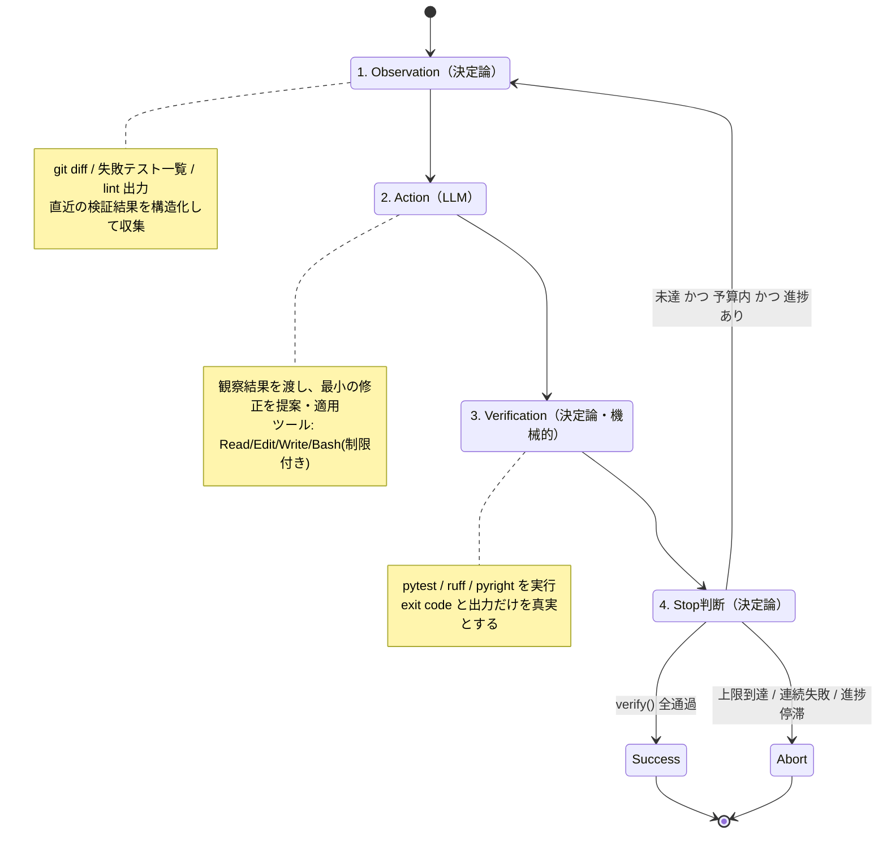

# 自律型エージェント ループ設計書（Agentic Loop Design）

Updated: 2026-07-20

自律的に「業務プロセスを実行 → 機械的に検証 → 継続/停止を判断」するループシステム（Agentic Loop）の
設計仕様・プロンプトテンプレート・実装骨組み・リスク対策をまとめる。

このリポジトリの計測ループ思想（実行 → 記録 → 集計 → 判断）と同じく、**「動かす」より「止め方と検証」を先に設計する**方針で書く。

---

## 0. スコープと前提の確定（テンプレの空欄を埋める）

要求仕様のプレースホルダは、最も一般的で検証が機械化しやすいケースに固定して具体化する。
別スコープに転用する場合は本節だけ差し替えれば全体が成立するよう設計している。

| 項目 | 本設計での確定値 | 差し替えポイント |
|---|---|---|
| **目的** | コード改修 / リファクタリング / テスト自動化の自律実行 | タスク種別 |
| **ターゲット環境** | 3案を比較 →（結論）**Claude Agent SDK** を推奨。理由は §2 | エージェント基盤 |
| **対象スコープ** | 単一リポジトリ内の特定ディレクトリ（例 `src/`）の Python コード | `TARGET_DIR` |
| **完了条件（Verify）** | ① `pytest` 全通過 ② 構文・型エラーゼロ（`ruff` + `pyright`）③ 変更対象外テストの非破壊 | `verify()` 関数 |
| **モデル** | `claude-opus-4-8`（長期ホライズンなエージェント実行に最適・1M context） | `MODEL` |

> **原則（このリポジトリの判断ルールを継承）**: 自動送信しない / 自動削除しない / 既存ファイルの破壊的変更は検証ゲート通過後のみ。
> final commit / push / publish は人間が行う（ループはブランチ上の作業まで）。

---

## 1. ループアーキテクチャ設計

中核は **O-A-V-S ループ**：状態観察（Observation）→ 行動実行（Action）→ 機械的検証（Verification）→ 停止判断（Stop Condition）。
LLM に判断させるのは Action だけ。**Observation / Verification / Stop は決定論的コード（LLM を通さない）**にするのが安定運用の要。



### 1.1 各フェーズの責務

**① Observation（観察・決定論）**
LLM に渡す「現在の状態」を機械的に組み立てる。ここに主観を入れない。

- `git diff`（前イテレーションの変更）
- `verify()` の直近の失敗内容（失敗テスト名・トレースバック・lint 指摘）を **上位 N 件に切り詰めて** 渡す（コンテキスト暴発防止）
- 残り予算（残イテレーション数・残トークン）を明示 → エージェントにペース配分させる
- 過去に試して失敗した修正の要約（同じ手を繰り返させない「メモリ」）

**② Action（行動・LLM）**
観察結果を受けて **1 イテレーション = 最小の一手**。大改修を一度にやらせない。

- 許可ツール: `Read` / `Glob` / `Grep` / `Edit` / `Write` / 制限付き `Bash`
- 禁止: ネットワーク送信、`rm -rf`、対象ディレクトリ外への書き込み、`git push`
- 出力契約: 「変更したファイルと理由」を構造化して返す（監査・ブラックボックス化対策）

**③ Verification（検証・機械的）**
**ここが完了条件の唯一の真実源**。LLM の「直したはず」を一切信用しない。

```
verify() = (pytest exit==0) AND (ruff exit==0) AND (pyright exit==0) AND (対象外テスト非破壊)
```

出力は `PASS/FAIL` と、FAIL 時の構造化された失敗内容（次の Observation にフィードバック）。

**④ Stop Condition（停止判断・決定論）**
下表の **いずれか一つでも満たしたら停止**。「成功で止まる」だけでなく「失敗で止まる」を必ず持つ。

| 種別 | 条件 | 意図 |
|---|---|---|
| 成功停止 | `verify()` が全通過 | 目的達成 |
| 予算停止 | イテレーション数 ≥ `MAX_ITERS` | 無限ループ防止 |
| コスト停止 | 累積トークン ≥ `MAX_TOKENS` / 累積コスト ≥ `MAX_USD` | API コスト暴走防止 |
| 連続失敗停止 | verify FAIL が `MAX_CONSEC_FAILS` 連続 | 収束不能の早期検知 |
| 進捗停滞停止 | 失敗テスト数が `PLATEAU_WINDOW` 回連続で減らない | 「回してるだけ」の検知 |
| 退行停止 | 失敗テスト数が増加した（回帰の作り込み） | 悪化からの離脱 |
| 時間停止 | 経過時間 ≥ `WALL_CLOCK_LIMIT` | ハング対策 |

> **進捗（progress）の定義が設計の肝**。単なる「回数」ではなく「失敗テスト数の単調減少」で進捗を測る。
> 減らないなら、同じ場所をぐるぐる回っている（＝人間にエスカレーション）。

### 1.2 状態オブジェクト（ループ間で持ち越す最小状態）

```
LoopState:
  iteration: int
  tokens_used: int
  cost_usd: float
  consecutive_failures: int
  fail_count_history: list[int]   # 失敗テスト数の推移（進捗判定用）
  last_verify: VerifyResult | None
  attempted_fixes: list[str]      # 失敗した手の要約（同手反復の抑制）
```

---

## 2. ターゲット環境の比較（Claude Agent SDK / Claude Code / OpenAI Codex）

「誰がハーネス（ループ・コンテキスト管理）を持ち、誰がデプロイを持つか」で選ぶ。

| 観点 | **Claude Agent SDK**（推奨） | Claude Code（CLI） | OpenAI Codex |
|---|---|---|---|
| 形態 | ライブラリ（Claude Code をパッケージ化） | 対話/CLI ツール | クラウド/CLI エージェント |
| 組み込みツール | Read/Write/Edit/Bash/Glob/Grep/WebSearch/WebFetch + MCP + サブエージェント | 同左（CLI として） | ファイル編集・シェル実行 |
| ループ制御 | SDK がエージェントループを提供。**外側に自前の停止制御を被せられる** | CLI が内包（プログラムからの細粒度制御は弱い） | ツール側が内包 |
| 停止条件のカスタム | ◎ `query()` を自前の O-A-V-S ハーネスで包める | △ CLI 引数の範囲 | △ |
| Hooks / 権限 / 権限ゲート | ◎ hooks・permission mode で破壊的操作を遮断 | ○ | ○ |
| デプロイ | 自前ホスト | ローカル/CI | ベンダ側 |
| 本設計との相性 | **最良**（Action だけ SDK に委譲、O/V/S は自前決定論） | 良（人間同席の対話向き） | 可 |
| モデル | `claude-opus-4-8` 他 | 同左 | GPT系 |

**結論**: 本設計のように **停止条件・検証・観察を決定論で握りたい自律ループ** では、
組み込みコーディングツール一式を持ちつつ外側から制御を被せられる **Claude Agent SDK** が最適。
Action フェーズだけを SDK に委譲し、O-A-V-S の外殻は自前コード（§4）で持つ。

> 補足: Claude Agent SDK（`claude-agent-sdk` / `@anthropic-ai/claude-agent-sdk`）は Claude API の
> Tool Runner とは別物。前者は「Claude Code をライブラリ化した batteries-included なコーディングエージェント」、
> 後者は「自前定義ツールのループヘルパ」。本設計の Action 実装は前者を使う（§4 参照）。

---

## 3. システム指示文（System Instruction）テンプレート

無限ループ・迷走・破壊的操作を防ぐ **境界条件（Guardrails）** を必ず含める。
以下は Action フェーズのエージェントに与える system prompt テンプレート。

```text
あなたは自律型コード改修エージェントの「行動（Action）」を担当する。
1イテレーションで「最小の一手」だけを行う。全部を一度に直そうとしない。

## 目的
{OBJECTIVE}
（例: {TARGET_DIR} 配下の pytest をすべて通す。挙動を変えず失敗原因のみ修正する）

## 完了条件（あなたは判定しない・検証は外部が機械的に行う）
- pytest 全通過 / ruff・pyright エラーゼロ / 対象外テスト非破壊
- 「直したはず」は禁止。検証は必ず外部の verify() が下す。自己申告で完了を主張しない。

## 今回の観察（外部が用意した唯一の事実）
- 直近の失敗: {TOP_FAILURES}
- これまで試して失敗した手: {ATTEMPTED_FIXES}
- 残り予算: 残り {ITERS_LEFT} イテレーション / 残り約 {TOKENS_LEFT} トークン

## 境界条件（Guardrails / 絶対厳守）
1. 変更してよいのは {TARGET_DIR} 配下のみ。外部への書き込み禁止。
2. ネットワーク送信・パッケージの新規インストール・git push を行わない。
3. rm/削除・大規模リネーム・スキーマ破壊は行わない（既存を壊さない）。
4. テストを通すためにテスト自体を甘くしない（アサーション削除・skip・期待値改ざん禁止）。
5. 原因が不明なまま広範囲を書き換えない。まず最小再現に近い1ファイルを修正する。
6. 同じ修正を繰り返さない。{ATTEMPTED_FIXES} と同じ手は避け、別の仮説を立てる。
7. 予算が残り少ない場合は、最も失敗数を減らせる一手に絞る。

## 出力契約（監査可能性のため必須）
- 変更したファイルと、その1行理由を必ず列挙する（ブラックボックス化の防止）。
- 「なぜこの一手が失敗数を減らすと考えるか」を1〜2文で述べる。冗長な説明は不要。
```

> テンプレ変数（`{...}`）は Observation フェーズが埋める。
> Guardrail 4「テストを甘くしない」は最重要。Verify を報酬とする以上、
> エージェントは最短で「テストの方を壊す」誘惑に晒される。ここを言語化 + §4 で機械的にも検出する。

---

## 4. 実装サンプルコード（Python）

**設計の核は「外殻ハーネス」**。停止条件（最大ループ回数・トークン/コスト上限・連続失敗・進捗停滞）を
決定論で実装し、Action だけを Claude Agent SDK に委譲する。

```python
"""
agentic_loop.py — O-A-V-S 自律ループの制御骨組み。
Action だけを Claude Agent SDK に委譲し、Observation/Verification/Stop は決定論で持つ。
"""
from __future__ import annotations

import asyncio
import subprocess
import time
from dataclasses import dataclass, field
from pathlib import Path

# --- 設定（停止条件はすべてここに集約：安全弁は一箇所で管理する） -----------------
MODEL = "claude-opus-4-8"
TARGET_DIR = "src"

MAX_ITERS = 12               # 予算停止：最大ループ回数
MAX_TOKENS = 2_000_000       # コスト停止：累積トークン上限
MAX_USD = 15.0               # コスト停止：累積コスト上限（USD）
MAX_CONSEC_FAILS = 3         # 連続失敗停止
PLATEAU_WINDOW = 3           # 進捗停滞停止：失敗数が減らない許容回数
WALL_CLOCK_LIMIT = 60 * 30   # 時間停止（秒）

# opus 4.8: input $5 / output $25 per 1M tokens（概算コスト計算用）
PRICE_IN, PRICE_OUT = 5.0 / 1e6, 25.0 / 1e6


# --- 検証結果と状態 ---------------------------------------------------------------
@dataclass
class VerifyResult:
    passed: bool
    fail_count: int
    detail: str                       # 失敗テスト名・トレースバック（切り詰め済み）
    tests_tampered: bool = False      # テスト自体を甘くしていないか


@dataclass
class LoopState:
    iteration: int = 0
    tokens_used: int = 0
    cost_usd: float = 0.0
    consecutive_failures: int = 0
    fail_count_history: list[int] = field(default_factory=list)
    attempted_fixes: list[str] = field(default_factory=list)
    last_verify: VerifyResult | None = None
    started_at: float = field(default_factory=time.monotonic)


# --- ② Verification（機械的・唯一の真実源） ---------------------------------------
def _run(cmd: list[str]) -> subprocess.CompletedProcess:
    return subprocess.run(cmd, capture_output=True, text=True, timeout=600)


def verify() -> VerifyResult:
    """pytest + ruff + pyright を実行。exit code と出力だけを真実とする。"""
    pytest = _run(["pytest", TARGET_DIR, "-q", "--no-header"])
    ruff = _run(["ruff", "check", TARGET_DIR])
    pyright = _run(["pyright", TARGET_DIR])

    fail_count = pytest.stdout.count("FAILED") + pytest.stdout.count("ERROR")
    passed = pytest.returncode == 0 and ruff.returncode == 0 and pyright.returncode == 0

    # Guardrail 4 の機械的チェック：テストを甘くする改変を検出（git diff）
    diff = _run(["git", "diff", "--", "tests/"]).stdout
    tampered = any(sig in diff for sig in ("-    assert", "+@pytest.mark.skip", "+    pass  #"))

    detail = (pytest.stdout[-4000:] + "\n" + ruff.stdout[-1000:] + "\n" + pyright.stdout[-1000:])
    return VerifyResult(passed and not tampered, fail_count, detail, tampered)


# --- ① Observation（決定論的にプロンプト材料を組み立てる） ------------------------
def build_observation(state: LoopState) -> str:
    v = state.last_verify
    top_failures = (v.detail if v else "（初回：まだ検証結果なし）")[:3000]
    return (
        f"直近の失敗:\n{top_failures}\n\n"
        f"試して失敗した手:\n" + "\n".join(f"- {x}" for x in state.attempted_fixes[-8:]) + "\n\n"
        f"残り予算: 残り {MAX_ITERS - state.iteration} イテレーション / "
        f"残り約 {MAX_TOKENS - state.tokens_used} トークン"
    )


# --- ③ Action（LLM に委譲：Claude Agent SDK） -------------------------------------
async def run_action(state: LoopState) -> tuple[str, int, int]:
    """
    1イテレーション分の修正を Claude Agent SDK に実行させる。
    戻り値: (適用した一手の要約, input_tokens, output_tokens)

    権限ゲート（permission mode / allowed_tools）で破壊的操作を機械的に遮断する点が重要。
    ※ 実運用では claude_agent_sdk.query(...) を用いる（下は形の例示）。
    """
    from claude_agent_sdk import query, ClaudeAgentOptions  # type: ignore

    options = ClaudeAgentOptions(
        model=MODEL,
        system_prompt=SYSTEM_PROMPT_TEMPLATE.format(
            OBJECTIVE=f"{TARGET_DIR} 配下の pytest をすべて通す（挙動は変えない）",
            TARGET_DIR=TARGET_DIR,
            TOP_FAILURES=(state.last_verify.detail[:1500] if state.last_verify else "初回"),
            ATTEMPTED_FIXES="\n".join(state.attempted_fixes[-8:]),
            ITERS_LEFT=MAX_ITERS - state.iteration,
            TOKENS_LEFT=MAX_TOKENS - state.tokens_used,
        ),
        allowed_tools=["Read", "Glob", "Grep", "Edit", "Write", "Bash"],
        permission_mode="acceptEdits",  # 破壊的操作は hooks 側で拒否（§Guardrails）
        cwd=str(Path.cwd()),
    )

    summary, tok_in, tok_out = "", 0, 0
    async for message in query(prompt=build_observation(state), options=options):
        # message から適用内容の要約と usage を集計（SDK の message 種別に応じて実装）
        summary += getattr(message, "text", "") or ""
        usage = getattr(message, "usage", None)
        if usage:
            tok_in += getattr(usage, "input_tokens", 0)
            tok_out += getattr(usage, "output_tokens", 0)
    return (summary.strip()[:200] or "(no-op)"), tok_in, tok_out


# --- ④ Stop Condition（決定論的な安全弁：いずれか一つで停止） ----------------------
def should_stop(state: LoopState) -> str | None:
    v = state.last_verify
    if v and v.passed:
        return "SUCCESS: verify() 全通過"
    if v and v.tests_tampered:
        return "ABORT: テスト改変を検出（報酬ハック）"
    if state.iteration >= MAX_ITERS:
        return "ABORT: 最大イテレーション到達"
    if state.tokens_used >= MAX_TOKENS or state.cost_usd >= MAX_USD:
        return f"ABORT: コスト上限（{state.tokens_used} tok / ${state.cost_usd:.2f}）"
    if state.consecutive_failures >= MAX_CONSEC_FAILS:
        return "ABORT: 連続失敗上限"
    if time.monotonic() - state.started_at >= WALL_CLOCK_LIMIT:
        return "ABORT: 時間上限（ハング疑い）"
    # 進捗停滞：直近 PLATEAU_WINDOW 回、失敗数が単調減少していない
    h = state.fail_count_history
    if len(h) > PLATEAU_WINDOW and len(set(h[-PLATEAU_WINDOW - 1:])) == 1:
        return "ABORT: 進捗停滞（失敗数が減らない）→ 人間にエスカレーション"
    if len(h) >= 2 and h[-1] > h[-2]:
        return "ABORT: 退行検出（失敗数が増加）"
    return None


# --- メインループ -----------------------------------------------------------------
async def main() -> str:
    state = LoopState()
    state.last_verify = verify()          # 初回観察
    state.fail_count_history.append(state.last_verify.fail_count)

    while True:
        reason = should_stop(state)
        if reason:
            print(reason)
            return reason

        state.iteration += 1
        summary, tok_in, tok_out = await run_action(state)
        state.tokens_used += tok_in + tok_out
        state.cost_usd += tok_in * PRICE_IN + tok_out * PRICE_OUT
        state.attempted_fixes.append(f"[iter{state.iteration}] {summary}")

        prev = state.last_verify.fail_count if state.last_verify else 10**9
        state.last_verify = verify()      # 機械的検証
        state.fail_count_history.append(state.last_verify.fail_count)

        if state.last_verify.passed:
            state.consecutive_failures = 0
        elif state.last_verify.fail_count >= prev:
            state.consecutive_failures += 1   # 減っていないなら失敗扱い
        else:
            state.consecutive_failures = 0    # 前進したのでリセット

        print(f"iter={state.iteration} fails={state.last_verify.fail_count} "
              f"tok={state.tokens_used} usd={state.cost_usd:.2f}")


SYSTEM_PROMPT_TEMPLATE = """..."""  # §3 のテンプレートを埋め込む

if __name__ == "__main__":
    asyncio.run(main())
```

### 4.1 設計上のポイント（コードの意図）

- **停止条件を一箇所（`should_stop`）に集約** — 安全弁を分散させない。追加/変更が一目で追える。
- **進捗を「失敗テスト数の単調減少」で定義** — 回数ではなく前進で測る。減らなければ停滞停止。
- **検証は完全に決定論** — `verify()` の exit code だけを信じ、LLM の自己申告は一切採用しない。
- **報酬ハックの機械検出** — 「テストを甘くして通す」を diff で検出して即 ABORT（Guardrail 4 の裏取り）。
- **コストは毎イテレーション積算** — トークン/USD をリアルタイムに追い、上限で強制停止。
- **権限ゲート** — Action は allowed_tools + permission mode + hooks で破壊的操作を機械的に封じる。

---

## 5. リスクと対策

| リスク | 兆候 | 対策（本設計での実装箇所） |
|---|---|---|
| **API コスト暴走** | トークン/コストが線形に増え続ける | `MAX_TOKENS` / `MAX_USD` を毎イテレーション積算し即停止。低 effort での試行や小さな一手の強制（§1.1）。1タスク1レコードで実コストを記録し週次レビュー（本リポジトリの計測ループに接続） |
| **無限ループ / ハング** | 同じ失敗を延々繰り返す・応答が返らない | 多層の停止条件：`MAX_ITERS`・進捗停滞・退行検出・`WALL_CLOCK_LIMIT`。`attempted_fixes` を観察に注入し同手反復を抑制 |
| **報酬ハック（テストを甘くする）** | テスト削除/skip/期待値改変で「通った」 | Guardrail 4 で禁止を明示 + `verify()` の diff 検査で機械検出 → 即 ABORT。対象外テストの非破壊も完了条件に含める |
| **理解の負債 / ブラックボックス化** | 何をなぜ変えたか追えない差分が積み上がる | 出力契約で「変更ファイル+理由」を必須化。1イテレーション=最小の一手に限定。全変更はブランチ上に残し、人間レビュー前提（自動 commit/push はしない） |
| **回帰（新たなバグ作り込み）** | 失敗テスト数が増加 | 退行検出で停止。対象外テストの非破壊を verify に含め、影響範囲外を壊したら FAIL |
| **偽の完了（幻覚的成功宣言）** | 「直しました」だが実際は未達 | 完了判定を LLM から剥がし、`verify()` の exit code のみを真実源にする |
| **破壊的操作 / 情報漏洩** | 対象外への書き込み・外部送信・削除 | allowed_tools 限定 + permission mode + hooks で機械的に遮断。ネットワーク/削除/push を禁止（本リポジトリの判断ルール継承） |
| **収束不能の抱え込み** | 予算を使い切るまで粘る | 進捗停滞で早期に人間へエスカレーション。「失敗で止まる」条件を必ず持つ |

---

## 付録: 本リポジトリの計測ループとの接続

このループは単発では終わらせず、**実行 → 記録 → 集計 → 週次レビュー**（`CLAUDE.md` のアーキテクチャ）に接続する。

- 1タスク完了ごとに効果を記録（短縮時間・品質・ミス予防・実コスト）
- 週次で「拡大・修正・中止」を判断（`weekly_automation_review.md`）
- 停止理由（SUCCESS/ABORT 種別）の分布を集計 → どの Guardrail が効いているか / どこで詰まるかを可視化

> ループ設計の良し悪しは「うまく走るか」ではなく「安全に止まるか・止まった理由が読めるか」で決まる。
