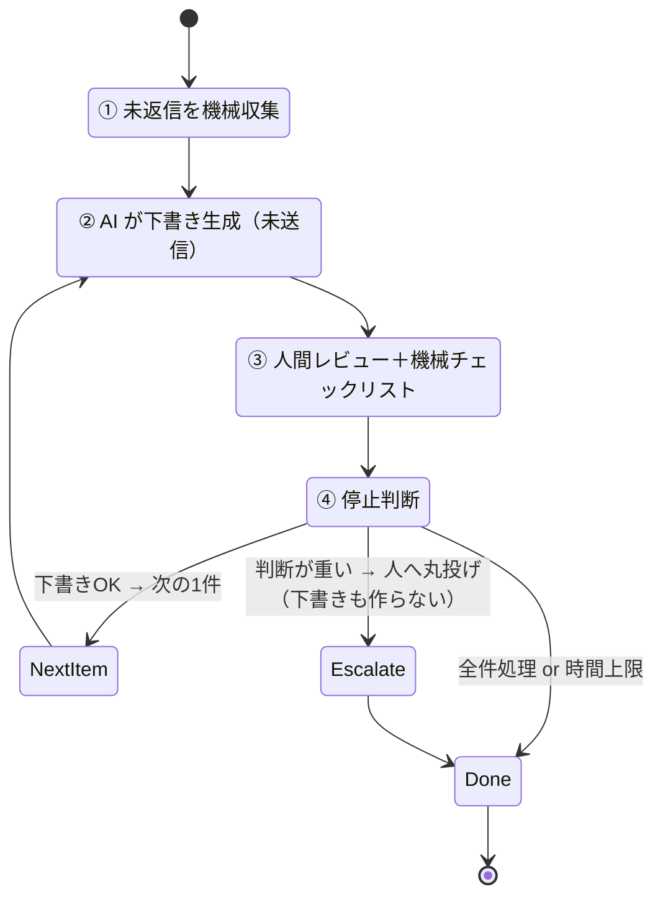

# reply-triage 運用ループ（O-A-V-S 適用版）

Updated: 2026-07-20

`automation_priority_roadmap.md` 優先度1「要返信メール・サイボウズの拾い出しと返信下書き」を、
自律ループの枠組み **O-A-V-S**（観察 → 行動 → 検証 → 停止判断）に当てはめた**日次運用手順**。

汎用のループ設計（`agentic_loop_design.md`）を、機械判定が無いオフィス業務向けに翻訳したもの。
コードではなく「プロンプト＋チェックリスト＋Linear ステータス＋効果記録」で同じ構造を実現する。

---

## この業務ならではの前提

ソフト開発の `pytest` のような**機械的な合否判定（Verify）が存在しない**。
だから完了判定を AI に握らせず、**Verification を「人間レビュー＋機械チェックリスト」で代替**する。
これは既存ルール「自動送信しない・下書き止まり・人間が最終」の裏付けそのもの。

| 項目 | 本ループでの確定値 |
|---|---|
| 目的 | 返信漏れと文脈把握時間を減らす。**下書きまで**を自動化し、送信は人 |
| 起動条件 | 毎朝 8:30 / 毎夕 16:30 / CP（クリティカルパス）案件で待ちが発生した時 |
| 入力 | Gmail、サイボウズOffice の未返信、タスクボードのクリティカル案件 |
| 出力 | 要返信一覧・返信下書き・次アクション（すべて Linear `人確認待ち` へ） |
| workflow 値 | `reply-triage`（`effect_log.csv` の固定語彙。勝手に増やさない） |

---

## O-A-V-S マッピング

| フェーズ | ソフト開発版 | reply-triage 版 |
|---|---|---|
| **Observation** | git diff / 失敗テスト | Gmail・サイボウズの未返信、CP案件の停滞を**機械的に収集** |
| **Action（AI）** | コード修正 | 返信下書き・文脈要約・次アクションを生成（**送信しない**） |
| **Verification** | pytest exit code | **人間レビュー＋機械チェックリスト**（後述）。ここが唯一の合否 |
| **Stop** | 全テスト通過 / 上限 | 全件下書き完成 / 判断が重い案件はエスカレーション / 時間上限 |



---

## ① Observation（未返信を機械的に集める）

AI に判断させる前に、対象を決定論的に確定する。ここに主観を入れない。

- 直近24時間の重要チャンネル / Gmail から**返信が必要な投稿だけ**抽出
- CP（クリティカルパス）案件で「待ち」になっているものを別枠でマーク
- 各項目に「文脈要約・未決事項」を付けて構造化（下書き生成の材料）

プロンプト（`prompt_templates.md` の Slack triage を Gmail+サイボウズに拡張）:

```text
直近24時間のGmailとサイボウズOfficeの未返信を見て、返信が必要なものだけ拾ってください。
各件について、文脈要約・未決事項・返信下書きを出してください。送信はしないでください。
クリティカルパス案件で待ちが発生しているものは別枠で先頭に置いてください。
```

---

## ② Action（下書きを作る・送らない）

1件ずつ、最小の一手。「全部まとめて送信可能な完成品」を狙わない。

- 出力は**返信下書き＋次アクション**のみ。宛先・金額・日付は**原文から変更しない**
- CP案件を優先（停滞を最短で減らす一手）
- Linear ステータスを `AI起案中` → 生成後 `人確認待ち` へ

---

## ③ Verification（機械判定が無い代わりのゲート）

**完了判定を AI にさせない。** 下記チェックリストを人間が通したものだけ「下書き完成」とする。
`[機械]` は目視でなくルール/照合で確認できる項目（将来スクリプト化の候補）。

| # | チェック項目 | 種別 |
|---|---|---|
| 1 | 未送信であること（ドラフト保存のみ） | `[機械]` |
| 2 | 宛先が原文と一致（勝手に変えていない） | `[機械]` |
| 3 | 金額・日付・単位が原文と整合（改ざん・幻覚なし） | `[機械]` |
| 4 | 対象チャンネル/受信箱を網羅（拾い漏れなし） | `[機械]` |
| 5 | 判断が重い案件（final send/契約/支払/減額）が下書きに混じっていない | 人 |
| 6 | 文脈・敬語・相手が気にする点が妥当 | 人 |

- 1件でも 1〜4 が NG → その下書きは破棄して Action やり直し
- 5 が該当 → **下書きも作らずエスカレーション**（下の Stop 参照）

---

## ④ Stop Condition（止め方を先に決める）

| 種別 | 条件 | 次の行動 |
|---|---|---|
| 成功停止 | 対象の全件が下書き完成（`人確認待ち`） | 人間レビュー → 送信は人 |
| エスカレーション停止 | 判断が重い案件（final send/削除/契約/支払） | 下書きを作らず人へ丸投げ。Linear `人確認待ち` に「要人判断」と明記 |
| 時間停止 | 8:30/16:30 の枠（例 20分）を超過 | 未処理は次の枠 or Obsidian に戻す |
| 停滞停止 | CP案件の停滞が減らない | 人にエスカレーション（AI で回し続けない） |

> **進捗の定義**: 「何件下書きしたか」ではなく **「返信漏れ件数・CP停滞件数が減ったか」**。
> これは roadmap の KPI と一致。減らないなら回し続けず人に渡す。

---

## Linear ステータス連動

```
Inbox → AI起案中 → 人確認待ち → 実行中(＝人が送信) → 完了
```

- `AI起案中`: Observation で拾った要返信をここへ
- `人確認待ち`: 下書き完成（③のチェック通過）はここで止める。**AI はここまで**
- `完了` 条件（`linear_workflow.md` 準拠）: 送信済み＋次アクションが閉じた＋再利用可能な結果は GitHub へ

---

## Guardrails（境界条件）

1. 自動送信しない・自動削除しない（下書き止まり）
2. 宛先・金額・日付を原文から変更しない
3. 対象スコープ外（無関係チャンネル）に手を出さない
4. final send / delete / publish / contract / payment は人間
5. 拾い漏れを隠さない（自信が無ければ「未確認」と明記）
6. 同じ下書きを繰り返さない。差し戻されたら別の言い回しで一手

---

## 効果記録（1タスク1レコード）

各実行後に `record_ai_effect.ps1` で記録（`workflow` は固定語彙 `reply-triage`）:

```powershell
.\record_ai_effect.ps1 -Date 2026-07-20 -TaskType "triage" -TaskName "朝の要返信下書き" `
  -EstimatedManualMinutes 25 -ActualMinutes 10 -QualityScore 4 `
  -MistakePrevented $true -Workflow "reply-triage" -PluginsUsed "Gmail,Codex" `
  -Notes "未返信5件を下書き。CP案件1件を優先。送信は人。"
```

追跡する KPI（roadmap 準拠）:

- 1日あたり短縮時間
- 返信漏れ件数
- 下書き採用率（人がそのまま使えた割合）
- クリティカル案件の停滞件数

---

## 運用フロー（擬似手順）

```text
起動（8:30 / 16:30 / CP待ち発生）
  └─ ① Observation: Gmail+サイボウズの未返信を機械収集、CP案件を先頭に
  └─ 各件について（時間枠 or 全件まで）:
       ├─ 判断が重い案件？ → Yes: 下書き作らず「要人判断」でエスカレーション → 次へ
       ├─ ② Action: 返信下書き＋次アクション生成（未送信）
       ├─ ③ Verification: 機械チェック1〜4 → NGなら破棄しやり直し / 人レビュー5〜6
       └─ OK → Linear `人確認待ち` へ
  └─ ④ Stop: 全件完成 or 時間超過 or CP停滞が減らない
  └─ record_ai_effect.ps1 で効果を1レコード記録
```

---

## 週次レビューへの接続

- `summarize_ai_effect.ps1` で集計 → `weekly_automation_review.md` に転記
- 見るべき点: 下書き採用率が低い＝プロンプト改善余地 / エスカレーション頻度＝AI に任せる範囲の再設定
- 停止理由（成功 / エスカレーション / 時間 / 停滞）の分布で、どの Guardrail が効いているかを可視化

> ソフト開発版との違いは Verify の主体だけ（機械 → 人＋機械チェックリスト）。
> 骨格（観察を機械化し・完了を AI に握らせず・止め方を先に決める）は同じ。
